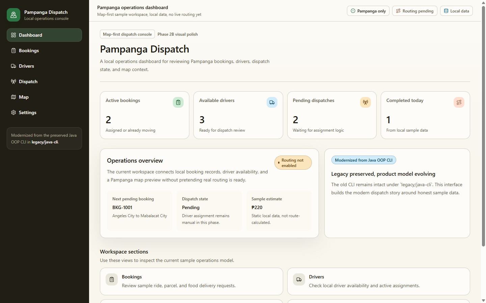
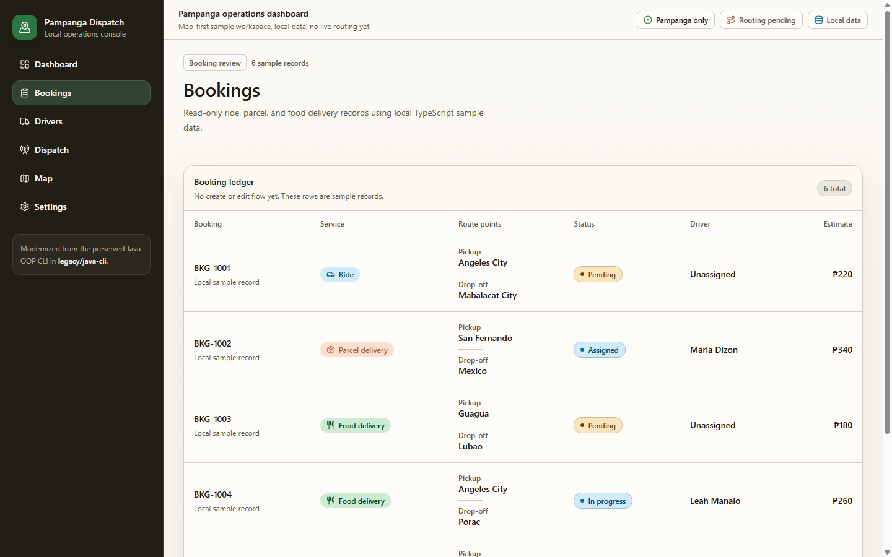
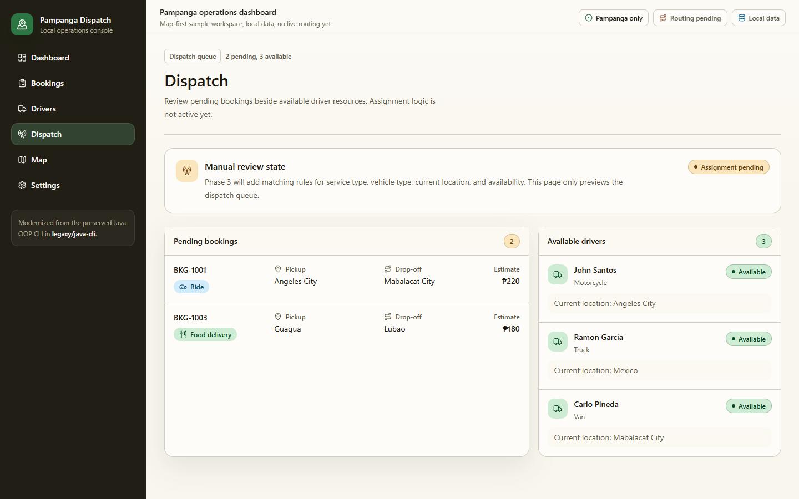
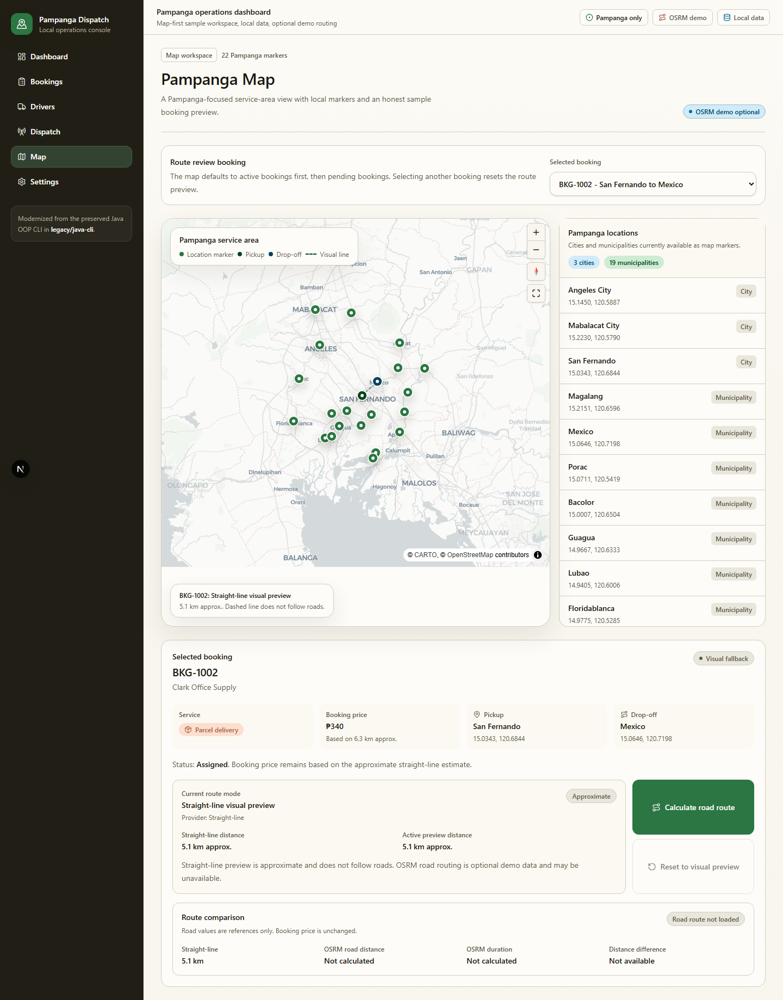
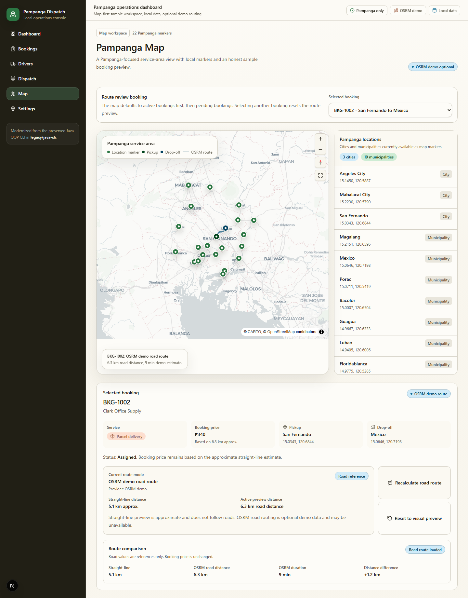

# Pampanga Dispatch

Pampanga Dispatch is a Pampanga-based delivery dispatch and route preview app modernized from an old Java OOP CLI final project. The current app is a local demo that shows the migration path from command-line booking records to a map-driven web dispatch workflow.

This is not a production logistics platform. State is session-only, there is no database yet, and OSRM road routing is optional demo infrastructure with a straight-line fallback.

## Screenshots

| Dashboard | Bookings | Dispatch |
| --- | --- | --- |
|  |  |  |

| Map straight-line preview | Map OSRM demo route |
| --- | --- |
|  |  |

## Demo Status

- Local demo app.
- Session-only booking, driver, dispatch, and route preview state.
- No database, authentication, or persistence yet.
- Straight-line route preview is the default.
- OSRM road route preview is user-triggered, optional, and demo-only.
- Booking prices remain tied to the app's approximate straight-line estimate.

## Feature Highlights

- Pampanga-only service area with local city and municipality data.
- Local booking creation for ride, parcel delivery, and food delivery.
- Driver roster with availability, vehicle type, location, and service capability.
- Deterministic driver suggestion and assignment.
- Booking lifecycle: pending, assigned, picked up, in transit, completed, cancelled.
- Driver release behavior after completion or valid cancellation.
- MapCN and MapLibre-powered Pampanga map view.
- Straight-line pickup/drop-off preview.
- Optional OSRM demo route with road distance and duration.
- Route fallback handling when OSRM is unavailable.

## Tech Stack

- Next.js App Router
- TypeScript
- Tailwind CSS
- shadcn/ui-ready component structure
- MapCN
- MapLibre GL
- OSRM demo route preview
- Node.js built-in test runner

## Legacy Project

The original Java OOP CLI project is preserved under `legacy/java-cli`. It includes the college-final-project source code and CSV-based persistence from the CLI version. The modern web app does not rewrite that Java code; it documents the old system and uses it as the historical baseline for a staged modernization.

See [docs/legacy-inventory.md](docs/legacy-inventory.md) for the legacy inventory.

## Architecture Overview

```text
src/app/                    Next.js routes and API handlers
src/components/             Shared app shell and UI primitives
src/domain/                 Booking, driver, location, route, and status models
src/data/                   Local Pampanga sample data
src/features/dispatch/      Session-only demo state provider
src/features/map/           Pampanga map and route preview components
src/lib/                    Distance, pricing, dispatch, booking, and routing helpers
tests/                      Node test runner coverage for dispatch and routing logic
legacy/java-cli/            Preserved original Java CLI project
docs/                       Project notes, QA evidence, and portfolio documentation
```

Key implementation points:

- `DispatchDemoProvider` holds local session state for bookings and drivers.
- Domain types keep booking, driver, location, status, and route logic explicit.
- Route helpers separate straight-line preview, OSRM parsing, fallback selection, and comparison values.
- `/api/routes/osrm` validates coordinates and calls OSRM only when the user requests a route.
- OSRM failures return typed fallback states instead of breaking the map.

See [docs/architecture.md](docs/architecture.md) and [docs/routing-notes.md](docs/routing-notes.md) for more detail.

## Local Development

```bash
npm install
npm run dev
npm test
npm run lint
npm run build
```

Then open `http://localhost:3000`.

## Demo Flow

A practical reviewer flow is documented in [docs/demo-script.md](docs/demo-script.md):

1. Review the dashboard metrics.
2. Create a local booking.
3. Assign a driver in Dispatch.
4. Move the booking through its lifecycle.
5. Open the Pampanga map.
6. Calculate an optional OSRM demo road route.
7. Reset to the straight-line visual preview.

## Current Limitations

- State resets on refresh.
- No authentication or user roles.
- No database or persistence layer.
- No production routing infrastructure.
- No traffic model, road-closure data, or route caching.
- No multi-stop optimization.
- OSRM public demo availability can vary.
- Map route bounds are not automatically fitted to every selected route.

## Roadmap

- Persist bookings, assignments, and route previews.
- Add deployment and hosted demo setup.
- Add route caching and clearer routing provider boundaries.
- Evaluate self-hosted OSRM or a production-grade route provider.
- Add accessibility audit and keyboard-flow review.
- Expand portfolio documentation with deployment notes.

See [docs/roadmap.md](docs/roadmap.md) for the phased modernization roadmap.

## Portfolio Notes

- Case study: [docs/portfolio-case-study.md](docs/portfolio-case-study.md)
- Architecture: [docs/architecture.md](docs/architecture.md)
- Demo script: [docs/demo-script.md](docs/demo-script.md)
- GitHub presentation notes: [docs/github-profile-notes.md](docs/github-profile-notes.md)
- QA evidence: [docs/qa](docs/qa)

## License

No license has been selected yet.
